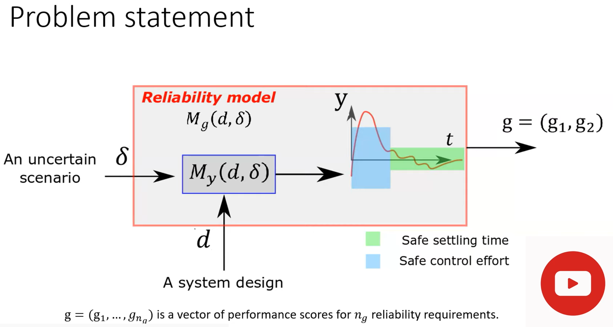

# Benchmark Problems for Robust Control Design


Please aknowledge this paper with problem description and solution attempt:
 
DOI https://doi.org/10.1115/DSCC2019-8949

``` bibtex
@proceedings{10.1115/DSCC2019-8949, 
author = {Rocchetta, Roberto and Crespo, Luis G. and Kenny, Sean P.}, title = "{Solution of the Benchmark Control Problem by Scenario Optimization}", 
volume = {Volume 2},
series = {Dynamic Systems and Control Conference}, year = {2019}, month = {10}, 
doi = {10.1115/DSCC2019-8949}, url = {https://doi.org/10.1115/DSCC2019-8949}}
```

```
######################################################################
######  [1] proposed and analyzed4 designs ###########################
######################################################################
# Candidate controller design    
#   𝒮𝒫1(𝒟,0) 𝒮𝒫1(𝒟,.05) 𝒮𝒫2(𝒟) Nominal
# 𝑎4  0.2238   0.5375    0.7600  0.5503
# 𝑎3  0.6811   1.3346    1.9491  1.4175
# 𝑎2  3.1275   2.4206    3.0497  2.6531
# 𝑎1  2.3615   2.1689    2.7344  2.4802
# 𝑎0  1.1833   0.8084    1.0594  1.0000
# 𝑏3 −0.0982   2.4802   −0.0831 -0.1324  
# 𝑏2  0.4702   0.6146    0.6358  0.3533
# 𝑏1  0.5886   0.5265    0.7752  0.6005
# 𝑏0  0.0777   0.0716    0.0981  0.0728
 ```


## See presentation of the challenge (presented at the Julia Reach Workshop 2022) problem for more details:
https://github.com/Roberock/ControllerRobust/blob/master/References%20and%20presentation/Challenge%20RBDO%20controller.pdf

[](https://www.youtube.com/https://www.youtube.com/watch?v=_wyqEt6J3Zw&ab_channel=JuliaReach)
